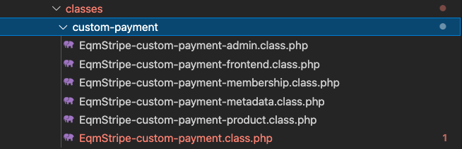

# Custom Payment Checkout

## Definició

El **Custom Payment Checkout** és el sistema que proporciona a l'usuari una pàgina privada
per usuari, amb un checkout amb els productes seleccionats, preus i fraccionaments. 

Amb l'objectiu de dotar a l'usuari de la compra de productes a preus personalitzats 

Per a utilitzar-lo és necessari tenir instal·lat el pluguin de Woocommerce 
[Stripe by Woocommerce](https://woocommerce.com/products/stripe/). 

El **Custom Payment Checkout** està integrat dins el mòdul de **stripe** de l'aplicació de l'ETS.

## Organització arxius

L'organització del Custom Payment Checkout, integrat dins el mòdul d'Stripe es el següent:
&nbsp; 

* `classes`- El domini de l'aplicació s'ubica dins la carpeta **custom-payment** on hi trobem les principals
classes per al funcionament. 
* `template-parts` - La part visual s'ubica dins la carpeta de *template-parts*
* `javascript` - S'ubica dins *assets/js* 

## Definició classes

**EqmStripeCustomPayment**

*eqm/modules/Woocommerce/stripe/classes/custom-payment/EqmStripe-custom-payment.class.php*

Classe principal de l'aplicació, encarregada de generar i llegir la url amb les dades 
dels productes a comprar i l'usuari apte per realitzar l'acció.

***

**EqmStripeCustomPaymentFrontEnd**

*eqm/modules/Woocommerce/stripe/classes/custom-payment/EqmStripe-custom-payment-frontend.class.php*

Construeix la pasarel·la de pagament via Stripe en una pàgina creada al gestor anomenada
*stripe-custom-checkout* 

>Obtindrem una pasarel·la de pagament amb els producte o productes amb l'import i caracteristiques
que s'hagin seleccionat.

>La url és personal per l'usuari per a qui ha estat creada la comanda. Si aquest usuari no 
està logat, ens redigirà a la pàgina de login.

***

**EqmStripeCustomPaymentAdmin**

*eqm/modules/Woocommerce/stripe/classes/custom-payment/EqmStripe-custom-payment-admin.class.php*

S'encarrega de l de construir el formulari dins la pàgina del perfil d'usuari de l'administrador.

***

**EqmStripeCustomPaymentMetadata**

*eqm/modules/Woocommerce/stripe/classes/custom-payment/EqmStripe-custom-payment-metadata.class.php*

Els productes poden tenir diferents **condicions**. Tal i com està construït l'aplicació esta preparada per a l'escalavilitat
de propietats i condicions. 

Per cadascuna d'aquestes condicions crearem als **product item metas** les propietats oportunes per a cada ocasió. 

Aquesta classe s'encarregarà de controlar i donar resposta a aquests casos en materia de metadates.

La seqüencia de construcció de les metadates la trobem a:

    private function initActions() {
			
		/** Metadata to save conditions for pass to Stripe metadata */

		// First step - Add cart item data if custom checkout has conditions
		add_filter( 'woocommerce_add_cart_item_data', [ $this, 'set_item_cart_data' ], 10, 3 );
		
	
		// Second step - Save cart item data in order item meta
		add_action( 'woocommerce_add_order_item_meta', [ $this, 'adding_data_in_order_items_meta' ], 10, 3 );

		// Third step - Add order item meta in stripe metadata
		add_filter( 'wc_stripe_payment_metadata', [ $this, 'add_stripe_metadata'] , 20, 3 );

		// Third step B - Add custom checkout payment fractioned params in stripe metadata
		add_filter( 'eqm_add_stripe_metadata_custom_checkout_payment_fractioned', [ $this, 'add_stripe_metadata_fractioned'] , 10, 3 );

	}

&nbsp; 
Es crea un filtre per cadascuna de les condicions que contingui el producte.

    $metadata = apply_filters( 'eqm_add_stripe_metadata_custom_checkout_payment_'.$condition, $metadata, $itemId, $order );

&nbsp; 
>Actualment només hi ha desenvolupada una condició que és el **pagament fraccionat**.

***

**EqmStripeCustomPaymentMembership**

*eqm/modules/Woocommerce/stripe/classes/custom-payment/EqmStripe-custom-payment-membership.class.php*

Classe encarregada de gestionar el pagament d'un carnet de soci. 
Tractar si aquest ha estat fraccionat, actualitzar la taula de Kpis i la data de caducitat del carnet.

***

**EqmStripeCustomPaymentProduct**

*eqm/modules/Woocommerce/stripe/classes/custom-payment/EqmStripe-custom-payment-product.class.php*

Classe encarreda de gestionar el pagament d'un producte no carnet de soci.
Actualment la classe s'encarrega principalement de gestionar els pagaments amb la **condició de fraccionat**.

## Fluxe de funcionament

    

## Creació de compra de productes

Per crear una pàgina de compra de productes primer haurem de generar una url personal per a l'usuari. 
Aquest és podrà realitzar **cridant directament la funció**, o a través de l'objecte que inserim a la **pagina
del perfil de l'usuari de l'administrador**.

&nbsp;

**Generar url**

Els arguments minims que hem d'enviar per **generar una url** de pagament a un usuari es una array de parametres amb l'id del producte
a comprar i el preu. Adicionalment li enviarem les condicions que ha de tenir al realitzar la compra, com el que veure'm en el pagament
fraccionat.
A la funció hi afegirem el mail de l'usari

    $customPaymentProductsParams = [ 
            [
				'id' => $originalProductId,
				'price' => $price_props[ 'amount' ],
			]
	    ];
		

    EqmStripeCustomPayment::instance()->generateURL( $customPaymentProductsParams, $userEmail );

&nbsp;

**Generar url de de l'administrador**

*eqm/modules/Woocommerce/stripe/classes/custom-payment/EqmStripe-custom-payment-admin.class.php*

El comportament per generar la URL des de l'administració és fa via JavaScript ubicat dins els assets d'Stripe. 
El fluxe per a la creació: 

* `1. Afegir item`

&nbsp;

    add_action( 'wp_ajax_eqm_stripe_custom_payment_add_item', [ $this, 'ajax_response' ]  );
	add_action( 'wp_ajax_nopriv_eqm_stripe_custom_payment_add_item', [ $this, 'ajax_response' ]  );

    $data = $this->getProductsInfoById();

&nbsp;

* `2. Afegir condicions` - Actualment es pot generar un pagament com si fos un **producte fraccionat**. 
Aquesta funció buscarà quina fracció és la que toca al producte i generarà l'array de parametres per a configurar-lo.

&nbsp;

    add_action( 'wp_ajax_eqm_stripe_custom_payment_fractioned_option', [ $this, 'ajax_response' ]  );
    add_action( 'wp_ajax_nopriv_eqm_stripe_custom_payment_fractioned_option', [ $this, 'ajax_response' ]  );

    $data = $this->getFractionedData();

&nbsp;

* `3. Generar URL` 

&nbsp;

    add_action( 'wp_ajax_eqm_stripe_custom_payment_generate_url', [ $this, 'ajax_response' ]  );
    add_action( 'wp_ajax_nopriv_eqm_stripe_custom_payment_generate_url', [ $this, 'ajax_response' ]  );

    $data = $this->generateUrl();

&nbsp;

> Actualment no s'ha desenvolupat la funcionalitat d'enviar la url directament per email.

 

> No es poden realitzar pasarel·les de pagament a usuaris que no tenen un compte creat.

## Creació de compra de productes fraccionats

Per a crear pagaments dels fraccionament dels productes li hauriem d'indicar a l'array d'arguments
el **producte pare** com a argument del producte. 
Posteriorment s'afegirà un argument de condicions on hi ficarem el llistat de les diferents condicions
que ha de tenir la compra del producte. En aquest cas el fraccionament.
Dins de les propietats del fraccionament, li afegirem totes aquells que enviarem a les metadates d'Stripe. 
 
Propietats a enviar:

    $customPaymentProductsParams = [
			'prod_'.$productId => [
				'id' => 'Id de woocommerce del producte pare',
				'price' => $price_props[ 'amount' ],
				'conditions' => [
					'fractioned' => [
						'item_meta_id' => 'Id de la metadata del producte original',
						'num_current_fraction' => 'Numero de la fracció que toca pagar',
						'num_fractions' => 'Nombre total de les fraccions que s'han de pagar per al producte',
						'order_id' => 'Order id de la comanda amb el producte pare',
						'price_id' => 'Id del preu de producte a Stripe ( Es troba dins la secció del productes )',
						'wc_product_id' => 'Id de woocommerce del producte fraccionat',
					]
				]
			]
		];

    EqmStripeCustomPayment::instance()->generateURL( $customPaymentProductsParams, $userEmail );

&nbsp;

La funció encarregada de rebre el pagament i analitzar les metadates es:

    public function product_payment_recieved( $stripe_data, $user_id, $metadata ) {

*eqm/modules/Woocommerce/stripe/classes/custom-payment/EqmStripe-custom-payment-product.class.php*

&nbsp;

Executarà la funció de pagament fraccionat, com si des d'stripe s'haguès rebut el webhook del invoice.payment_succeeded amb les 
metadates incorporades que la subscripció d'stripe conté.

    EqmStripeFractionedProduct::instance()->fractioned_payment_succeeded( $user_id, $product_id, $order_id, $order, $price_props );

&nbsp;

La particularitat del producte es que un cop pagat aquesta fracció li activarem l'accés al producte. 
Això es realitza amb la metadata **eqm-access-product**

    public function activateProductAccess( $user_id, $item_meta_id = null ) {
		
        if ( ! $item_meta_id ) {
		
			return;
		}

		wc_update_order_item_meta( $item_meta_id, 'eqm-access-product', 1 );

	}

*eqm/modules/Woocommerce/stripe/classes/custom-payment/EqmStripe-custom-payment-product.class.php*  

&nbsp;

## Creació de compra de carnets de soci

La compra dels carnets de soci mitjançant el custom payment checkout també és un cas especial ja que també
tenen una **subscripció creada a stripe**.

Al fer el pagament també haurem **d'actualitzar la data de caducitat del carnet**, i inserir el registre a la
taula de les kpis de periodes de soci **wp_eqm_kpis_members_periods**

    public function membership_payment_recieved( $stripe_data, $user_id, $metadata ) {

        .
        .
        .

        $price_props['metadata'] 	= (object) [
			'current_fraction' 		=> $metadata->eqm_cp_frac_current_frac,
			'num_total_fractions' 	=> $metadata->eqm_cp_fract_num_frac,
			'order_id' 				=> $metadata->eqm_cp_frac_order_id,
			'fractioned'			=> true
		];
	
		
		
		update_user_meta( $user_id, 'data_final_subscripcio', $metadata->eqm_scheduled_subscription_date );
		
		// Generate process like subscription membership fractioned succeeded has executed
		$paymentSucceeded = EqmStripeFractionedMembershipCard::instance()->fractioned_payment_succeeded( $user_id, $product_id, $order_id, $order, $price_props );

        .
        .
        .

    }

*eqm/modules/Woocommerce/stripe/classes/custom-payment/EqmStripe-custom-payment-membership.class.php*  

&nbsp;

Al igual que en procediment de crear un pagament fraccionat, actuarem com si s'hagues llençat un stripe webhook **invoice.payment_succeeded**,
amb les metadates per crear de nou la subscripció.

## Pàgina de pagament per l'usuari

*eqm/modules/Woocommerce/stripe/classes/custom-payment/EqmStripe-custom-payment-frontend.class.php*  

La passarel·la de pagament és gestiona des de la classe de Frontend. Encarregada de construir el **one page checkout** amb els productes, preus
i condicions. 
Inicialment és validarà que l'usuari estigui loguejat amb el mail que li passem per parametres, de no ser així, ens redigirà al login.

 

És necessari tenir una pàgina associada, amb la plantilla "Blank" per a poder construir la passarel·la de pagament.

