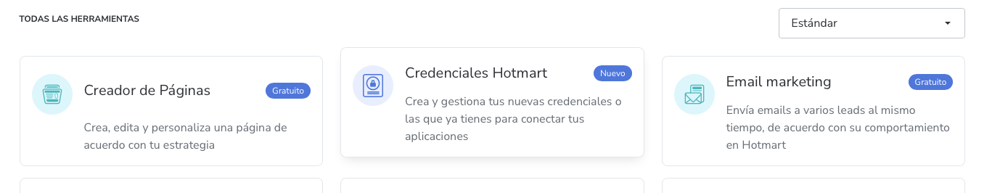

# Hotmart

## Definició

**Hotmart** és la plataforma de pagament que utilitzem per a realitzar pagaments
internacionals. Entre ells a Mèxic o Colombia. Dins de le opcions que ens permet Hotnart,
podem tenir una preu variable segons la divisa del moment o un preu fixe per a país.

Per a utilitzar-lo és necessari tenir un compte de
[Hotmart]( https://app-vlc.hotmart.com/dashboard ). 

&nbsp; 

## Configuració del producte a Hotmart

Per a crear i configurar un producte a la plataforma de Hotmart, seguirem el següents passos:
Es imprescindible que entrem a Hotmart, com a productors ja que sinó no tindrem accés a les opcions
que es detallaran a continuació.

&nbsp; 

**Crear producte** 

Buscar l'opció del menú de la dreta que fa referencia als productes.

&nbsp; 

Un cop clicada s'ens obrirà una pàgina amb totes les opcions per a configurar el producte.

&nbsp; 

**Crear preus** 

> Es important aquest pas perquè serà on registrem els preus per país i ens crearà una
passarel·la de pagament per a cadascun d'ells.

&nbsp; 

Haurem de crear un preu base i un altre per a cada país en el que es vulgui vendre. 
Per identificar i vincluar cada preu amb el país i la plataforma de l'ETS, és fa servir el **camp del nom del preu**. 
Com podeu veure en la imatge el nom ha de seguir aquesta nomenclatura.

    { "name": "Colombia", "code": "cl", "price":890000 }

&nbsp; 

* `name` - Nom del país, es **només identificatiu**. No s'utilitza a l'aplicació de l'ETS.
* `code` - Codi del país, ens servirà per **vincular el parametre que ens passin per URL amb la passarel·la de pagament** per al país de Hotmart.
* `price`- Preu en la moneda del país del **producte sense oferta**. El preu real s'agafarà del camp del valor de la precificació.

&nbsp; 

## Configuració credencials a Hotmart

**Crear credencials a l'API Developers** 

Per connectar-nos a les API's de Hotmart hem de crear les credencials a la plataforma de Hotmart.
Seleccionem l'opció del menú de la dreta **Herramientas**

Clicar sobre l'opcio de **Creadenciales Hotmart**

&nbsp; 

&nbsp; 

**Crear credencials a l'API Hotconnect Hotmart 2** 

Per crear les credencials per a l'API Hotmart 2, haurem d'anar a l'apartat **Herramientas**
i seleccionar l'opció **HotConnect**. Com es pot veure en la següent imatge:

&nbsp; 

Posteriorment crear les credencials, seleccionant l'opció del menú intern de la pàgina **Credenciales**

&nbsp; 

**Vincular credencials a l'ETS** 

Introduir les credencials obtingudes per Hotmart a l'arxiu de connexió de l'API.
Com que Hotmart té dos APIs haurem d'introduir les credencials per a cadascuna d'elles

    private $api_keys_hotmart_developers = [

        'dev' => [
            'client_id'     => 'xxxxxxxx',
            'client_secret' => 'xxxxxxxx', 
            'basic'         => 'Basic xxxxxxx', 
        ],

        'prod' => [
            'client_id'     => 'xxxxxxxxx',
            'client_secret' => 'xxxxxxxxx', 
            'basic'         => 'Basic xxxxxxx', 
        ],

    ];

    private $api_keys_hotconnect2 = [

        'dev' => [
            'client_id'     => 'xxxxxxxxxxxxx',
            'client_secret' => 'xxxxxxxxxxxxx', 
            'basic'         => 'Basic xxxxxxxxxxxxx', 
        ],

        'prod' => [
            'client_id'     => 'xxxxxxxxxxxxx',
            'client_secret' => 'xxxxxxxxxxxxx', 
            'basic'         => 'Basic xxxxxxxxxxxx', 
        ],

    ];

*eqm/modules/Woocommerce/hotmart/classes/EqmHotmart-api-connection.php*

&nbsp; 

## Hotmart Connect API

En l'ellaç trobarem la documentació a l'API. 
[API Hotmart Connect]( https://developers.hotmart.com/docs/en/ ). 

Aquesta API ens serveix per obtenir les vendes i susbscripcions.

&nbsp; 

## Hotmart 2 API

En l'ellaç trobarem la documentació a l'API. 
[API Hotmart 2]( https://app-connect.hotmart.com/documentation ). 

Aquesta API ens serveix per obtenir les dades dels productes i la seva precificació. 
L'utilitzarem per exemple en el curs de la Núria per obtenir el preu i la url del widget per 
la passarel·la de pagament per cada país.

> Important! Aquesta API desapareixerà el 31/12/2022.

&nbsp; 

## Connexió a les API's de Hotmart

Per connectar-nos a les dues API's de Hotmart ho farem a través del **curl** 
L'arxiu on realitzem la crida els serveis es:
&nbsp; 
*eqm/modules/Woocommerce/hotmart/classes/EqmHotmart-api-connection.php*

Per a connectar-nos a l'API realitzarem primer **l'autenticació**, ho farem mitjançant el seguent end point.

    $end_point  = 'https://api-sec-vlc.hotmart.com/security/oauth/token';

Només farem aquesta connexió la primera vegada o si la credencial ens ha caducat. 
Posteriorment es farà la crida a l'API, mitjançant el metode:

     public function apiCall( $end_point, $method = "get", $params = [], $api_version = 'hotmart_developers' ){

&nbsp; 

Disposem dels següents serveis:

    public function getSubscriptions( $params = null ){

    public function getProductOfferByCurrency( $product_id, $currency ){

    public function getUserByTransaction( $transaction ){

&nbsp; 

Actualment l'unic que usem és el de **getProductOfferByCurrency**, que ens retorna,
les opcions per país que tenim a Hotmart sobre un producte

&nbsp; 

## Webhooks

Hotmart crea webhooks que llença quan succeeixen certs esdeveniments en la plataforma. 
Necessitarem connectar-nos a aquests esdeveniments per tal d'actuar per a cadscun d'ells, serà
la nostra connexió amb Hotmart quan en la seva plataforma hi hagi actuacions 
Principalement utilitzarem els webhooks per rebre els esdeveniments de:

* `PURCHASE_COMPLETE`- Comanda realitzada correctament. Crearem un usuari ( si aquest no existeix ) i una comanda del producte a Woocommerce.
* `PURCHASE_CANCELED`- Comanda no realitzada. Crearem un usuari  ( si aquest no existeix ) i una comanda del producte fallida a Woocommerce.
* `PURCHASE_REFUNDED`- Retorn dels diners a Hotmart. Actuarem sobre la comanda vinculada la transacció a Woocommerce per tal que es vegi reflectit el retorn de l'import.

&nbsp; 

**Configurar Webhooks a Hotmart** 

Per a crear la connexió amb el nostre end point de connexió amb els webhooks hem d'anar a l'apartat
**Herramientas** del menú de l'esquerra de Hotmart. 

Accedir a l'apartat de **Webhook**. Crear un **hosted endpoint** amb la url: 

    https://soycomocomo.es/?wc-api=wc_hotmart

## Organització de carpetes, arxius i classes

L'organització del mòdul de Hotart es el següent:
&nbsp; 

**classes** 

Hi trobarem el domini de l'aplicació, encarregat de totes les funcionalitats i connexió amb Hotmart

* `EqmHotmart_Controller` - Classe principal controladora. Que inicialitza les intancies dels components de l'aplicació.
* `EqmHotmart_ApiConnection` - Connexió amb les API's de Hotmart
* `WC_Gateway_Hotmart` - **És necessari tenir una passarel·la de pagament**. L'haurem d'activar des de les passarel·les de pagament de Woocommerce per tal
de poder registrar la venda del producte a Woocommerce. Aquesta classe es l'encarregada de registrar, crear i configurar la
passarel·la de pagament de Hotmart.
* `EqmHotmart_Orders` - Creació de comandes a Woocommerce.
* `Utils` - Helpers de l'aplicació.
* `EqmHotmart_WebhookReader` - Punt d'entrada de la lectura dels Webhooks llençats per la plataforma Hotmart. Distribuirà els diferents **endpoints**.

&nbsp; 

**endPoints** 

S'hi ubiquen els endpoints dels webhooks que tenim registrats a la classe EqmHotmart_WebhookReader

* `EqmHotmart_PurchaseComplete` - Crea un usuari si aquest no existeix i una comanda completada del producte amb la passarel·la de pagament de Hotmart
( de Woocommerce ). Introduïm els metas necessaris.
* `EqmHotmart_PurchaseCanceled` - Crea un usuari si aquest no existeix i una comanda fallida del producte
* `EqmHotmart_PurchaseRefunded` - Registre d'una comanda existent on hi ha hagut una devolució via la plataform de Hotmart. 

&nbsp; 

## Fluxe de funcionament

&nbsp; 

## Promoció seqüencia Active Campaign per país

Podem crear una promoció de seqüencia d'Active Campaign per cadascun dels paisos.
Per fer-ho haurem d'associar el **producte de Hotmart amb el codi de país**, per registrar que 
l'usuari esta entran des d'un determinat país i es registri la promoció d'aquell país. 
Així per defecte li sortirà el preu i el widget de la passarel·la de pagament de Hotmart. 

Per fer-ho seguirem el següent procediment: 

**1.- Registrar el promoció d'Active Campaign per al país**
&nbsp; 
A la pàgina de producte dins l'administrador de l'ETS, anem a la pestanya de **Marketing** on
tenim les opcions de promoció de seqüencia d'Active Campaign. 
Primerament hi afegirem el codi de producte que tenim a Hotmart, es a dir, el id del producte. 
Afegirem els paisos, amb el codi de país que tenim dins el camp nom de la precificació del producte de Hotmart. 

**2.- Afegim el codi de país en una variable d'Active Campaign**
&nbsp; 
El funcionament és exactament igual que al crear una campanya de promoció de seqüencia.
S'haurà de crear una variable amb el codi que obtenim de cadascun dels mails.

**3.- Lectura d'arguments per país en la promoció**
&nbsp; 
La promoció de seqüencies d'Active Campaing carregarà la promoció i analitzarà el camp *country* i guardarà 
si existeix la **cookie** amb el país associat.
&nbsp; 

    public function eqm_promo_sequence_load(){

        $country 	= $_REQUEST['country'] ?? false;
        if ( $country ) setcookie( 'eqm_country', $country, time() + $left_promo_time, '/', COOKIE_DOMAIN, is_ssl(), true );

    }

*eqm/modules/Woocommerce/campaigns/promo-activecampaing-sequencies.php*

&nbsp; 
**4.- Incorporació del preu i widget de la passarel·la de pagamnet**
 
En el curs llegirem si té una promoció activa i si aquesta és de país. 
Obtindrem els paramtres de la promoció, **el preu, el preu sense oferta, la moneda i l'enllaç per a carregar
el widget de Hotmart** per a poder fer el pagament.

    function eqm_workshop_nuria_coll_country_price(){
        $query_param_country = 'country';

        $country 			= $_REQUEST[ $query_param_country ] ?? false;
        $country 			= $_COOKIE[ 'eqm_country' ] ?? $country;
        
        if ( $country === false ) return false; 
        
        $hotmartProductId 	= 2323268;
        $country_price 		= EqmHotmart_ApiConnection::instance()->getProductOfferByCurrency( $hotmartProductId, $country );

        return $country_price;
    }

*eqm/modules/Woocommerce/workshops/workshop-nuria-coll.php*

Si l'usuari ve de la promoció per país, es carregarà el template part dels preus especific per a Hotmart
anomenat **template-parts/com-menjar-millor-curs/price-block-hotmart.php**