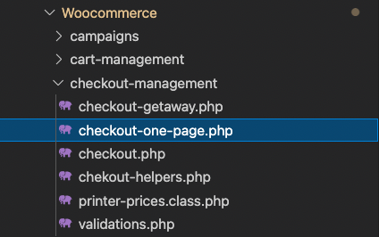
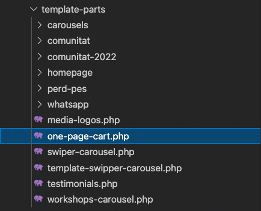
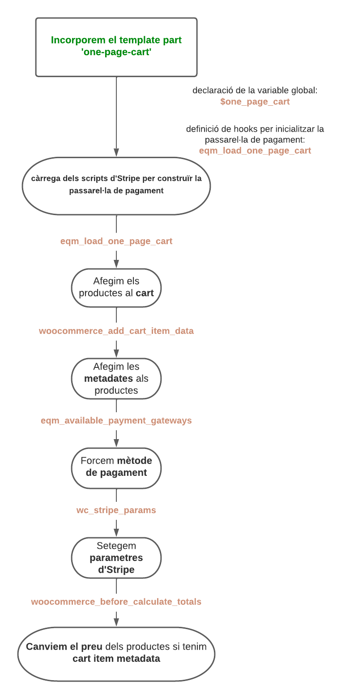

# One page checkout

## Definició

El **One Page Checkout** crea una passarel·la de pagament amb Stripe a poder incorporar en
qualsevol pàgina, amb la finalitat de fer una compra ràpida i senzilla.

Per a utilitzar-lo és necessari tenir instal·lat el plugin de Woocommerce 
[Stripe by Woocommerce](https://woocommerce.com/products/stripe/). 

El **One Page Checkout** està integrat dins el mòdul de **stripe** de l'aplicació de l'ETS.

## Utilització

Per a utilitzar-ho hem d'importar el template part del **one-page-cart**, amb l'array de productes
a comprar. 

	<?php get_template_part( 'template-parts/one', 'page-cart', [ 'products' => array_column( $products, 'id' ) ] ); ?>

&nbsp; 
>Important! S'ha d'incorporar la pàgina on inserirem el **One Page Checkout** al hook wp_enqueue_script per tal de modificar
el metode de pagament. Com s'indica a continuació:

&nbsp; 

	/**
	* Enqueue stripe scripts
	*/
	function eqm_one_page_checkout_enqueue_script_payment_scripts() {
		
		global $post;
		
		$one_checkout_pages = [ 'com-menjar-millor-nuria-coll', 'comunitat', 'stripe-custom-checkout' ];

		if ( IS_SOY ) {
			$one_checkout_pages = [ 'como-comer-mejor-nuria-coll', 'comunidad', 'stripe-custom-checkout' ];
		}
		if ( ! in_array( $post->post_name, $one_checkout_pages ) ) {
			return;
		}
		
		$_GET['change_payment_method'] = true;
	}

	add_action( 'wp_enqueue_scripts', 'eqm_one_page_checkout_enqueue_script_payment_scripts', 1 );

*eqm/modules/Woocommerce/checkout-management/checkout-one-page.php*

&nbsp; 

## Organització arxius

L'organització del **One Page Checkout**, integrat dins el mòdul de **Woocommerce** del plugin de l'ETS per un cantó i el template part
està dins del tema:
&nbsp; 

* `Lògica de negoci`- Integrat en el checkout-management del mòdul de Woocommerce 

* `Front end`- Dins el tema, en les template parts. 

&nbsp; 

## Fluxe de funcionament

