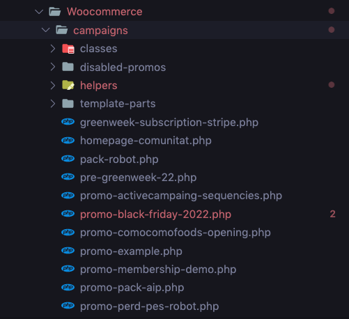
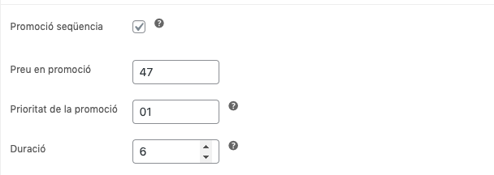
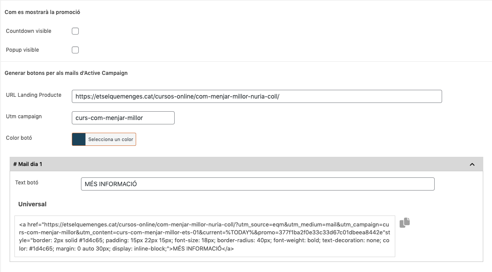

# Promocions

## Definició

El mòdul de **campaigns** integrat dins el mòdul de **Woocommerce** del plugin de l'ETS té com
a objectiu montar una estructura amb la finalitat que crear una promoció sigui molt senzill,
intuitiu i ordenat. Aïllant la promoció d'altres mòduls. 

Està creat per a que sigui **escalable i customitzable** per a cadascuna de les promocions, però que
alhora tingui les **eines més essencials i comunes** en cadascuna de les campanyes que es realitzen,
per tal d'estalviar feina al crear-les. 

Entre les eines que es comparteixen hi ha les **dates de duració, funcionalitats de visualització, com la incorporació de footer amb i sense countdown, creació de popups, prenavs i banners**.

## Crear una promoció

Crear una promoció és molt senzill, podem agafar com a mòdel qualsevol altra promoció ja creada,
que tingui unes caracteristiques similars a la campanya a realitzar o fer una copia de la 
**promoció d'exemple** que trobarem dins carpeta de campanyes. 

He un seguit de passos necessaris:
&nbsp; 

**1. Canviar el nom de la classe de la promoció**
&nbsp; 
Canviar el nom on aparegui **PromoExample** per un nom en camel case que identifiqui la promoció
 

    if ( ! class_exists( 'PromoExample' ) ) {

        class PromoExample extends Promo {

*eqm/modules/Woocommerce/campaigns/promo-nom-promocio.php*

**2. Setejar els parametres de la promoció**
&nbsp; 
Per defecte ja hi han ficats uns parametres que normalment són comuns en totes les promocions,
no és obligatori setejar-los si la nostra promoció té uns parametres diferents.

* `$start_date = '2021-11-20 18:00:00'`- Data d'inici de la campanya;
* `$end_date = '2021-11-20 18:00:00'`- Data final de la campanya;
* ` $template_folder = 'folder-name'`- Carpeta dins els **template-parts** on ubicarem els template parts propis de la campanya

&nbsp; 

**3. Donar les pautes d'activació de la promoció**
&nbsp; 
La funció **promo_is_active()** és la que ens indica les condicions per les quals la promoció
estarà activa. 
Per defecte el metode analitzarà si el moment actual es troba dins els rang de dates en les
quals la promoció està activa. 
**Aqui però hi podem ficar qualsevol altra condició**

    /**
    * Get logical of active promo
    *
    * @return bool
    * @throws \Exception
    */
    public function promo_is_active() {
        $date  = new DateTime( 'now', new DateTimeZone( 'Europe/Madrid' ) );
        $now   = $date->getTimestamp() + $date->getOffset();
        $start = strtotime( $this->start_date );
        $end   = strtotime( $this->end_date );

        return $now > $start && $now < $end;
    }

> **Important!** Aquesta funció es cridarà al iniciar la classe, no hi podrem ficar
cap metòde de Wordpress que faci referencia a la pàgina. Ja que aquests es construeixen 
despres del hook **init**.
És a dir, no podrem fer referencia a metodes propis de Wordpress com is_checkout(), is_page(), is_product()...

&nbsp; 

> Per utilitzar aquests metodes es farà en el metode **init()**, que es crida amb el hook
**template_redirect** 

&nbsp; 

**4. Afegir les condicions propies de la promoció**
&nbsp; 
Aquest apart ja depen de les propietats o requisits que tingui la campanya. 
podrem utilitzar els mètodes **declareHooksAndFilters** o **init** per iniciar 
la campanya.

    /**
        * Set hooks
        *
        * @throws \Exception
        */
    public function declareHooksAndFilters() {
        if ( ! $this->promo_is_active() ) {
            return;
        }

        // Insert actions and filters registered
        // before 'template_redirect'

    }  

Aquesta funció es invocada abans de llençar-se el hook **template_redirect**     
&nbsp; 

    /**
    * Init after template is loaded
    *
    * @throws \Exception
    */
    protected function init() {
        
        // Insert actions and filters registered
        // after 'template_redirect'
        
        if ( ! $this->promo_is_active() ) {
            return;
        }

        if ( is_single() || is_front_page() || is_product() ) {
            
            $this->putPreNav( $this->end_date );
            $this->putFooter( $this->end_date );
            $this->putPopup();

        }

    }       

Aquesta funció es invocada després de llençar-se el hook **template_redirect**, aqui si obtindrem
resposta a les funcions de Wordpress que fan referencia a la pàgina actual, is_single(), is_front_page(),... 
&nbsp; 

## Organització de carpetes, arxius i classes

L'organització del mòdul de Campanyes es el següent:
&nbsp; 

**classes** 

Hi trobarem el domini de l'aplicació, encarregat de totes les funcionalitats i connexió amb Hotmart

* `ControllerCampaigns` - Classe principal controladora. Que llegeix i inicialitza les campanyes actives.
* `Promo` - Classe pare de cadascuna de les campanyes.

&nbsp; 

**disabled-promos** 

Promocions no actives. Les promocions ubicades en aquesta carpeta no és carregaran.

&nbsp; 

**helpers** 

Funcions útils que són cridades des de diferents punts de l'aplicació.

&nbsp; 

**template-parts** 

Templates de les campanyes.

&nbsp; 

## Funcionament

Des de la classe  **ControllerCampaigns** inicialitzada a **module.php** del mòdul de Woocommerce
és l'encarregada de llegir les campanyes de la carpeta de **campaigns** 
Perquè una campanya sigui llegida i inicialitzada ha d'extendre de la classe **Promo**

    /**
    * Scan campaigns in folder 'campaigns'
    * Only get files that class extends Promo class
    *
    * @return void
    */
    public function scanCampaigns() {
        .
        .
        .

        foreach ( $classes as $classProp ) {
            $classCampaign = 'eqm\Campaigns\\' . $classProp['class'];

            $this->campaigns[ $classProp['class'] ] = new $classCampaign( $classProp['file'] );

        }
    }

*eqm/modules/Woocommerce/campaigns/classes/ControllerCampaigns.php*

La classe pare **Promo** serà l'encarregada d'inicialitzar la **campanya** i invocarà els metodes d'inicialització
de la campanya. 

Un cop es llegeix la campanya és declaren les accions

    /**
    * Set hooks
    *
    * @return Void
    */
    private function declareHooks() {
        add_action( 'setup_theme', [ $this, 'declareHooksAndFilters' ], 1 );
        add_filter( 'emq_filter_banners_mobile_and_sidebar', [ $this, 'add_banners' ], 999 );
        add_action( 'eqm_workshops_include_template', [ $this, 'load_template' ] );
    }

*eqm/modules/Woocommerce/campaigns/classes/Promo.php*

Aquestes cridaràn els metodes, el primer **declareHooksAndFilters**, just a principi de carregar l'aplicació. 
Aquest metòde es cridarà sempre, sense evaluar si la campanya s'ha iniciat. Per tant haurem de fer aquesta comprovació
si s'escau des del metode **declareHooksAndFilters**. 

On si que s'evaluarà la condició serà previament a la invocació del metòde **init** 

La classe pare **Promo** també serà l'encarregada de pintar funcionalitats comunes com, el footer amb o sense coundown,
popup o prenav. 
La classe també conté els metòdes per carregar un template-part ubicat en carpeta que hem indicat en les propietats
de la campany.

&nbsp; 

## Crear elements ( footer, popup, prenav, banners... )

És molt comú en la creació de campanyes l'utilització d'elements visuals com un footer
amb o sense coundown, popup o prenav. 
Per aquest motiu, la classe pare **Promo** ja té les funcionalitats incorporades per a crear
aquests elements. 
Aquests elements és poden customitzar ja que carregarà les vistes que tenim en carpeta de la 
campanya dins els **template-parts**

**Crear footer amb countdown** 

Criadarem els següents metòdes per incloure el peu.

    $this->putFooter( $this->end_date );

    /**
    * Get if is possible print popup, and print it
    *
    * @param $end_date
    *
    * @throws \Exception
    */
    private function putFooter( $end_date ) {
        // Function located in Promo base class
        $args =[]; 
        $this->printFooter( $end_date, $args );
    }

La funció **printFooter** ubicada a **Promo** rep el parametre de la data final i s'en poden incloure d'altres per
a construir el peu amb o sense countdown. 
El que fara **printFooter** és carregar el template part amb el nom **promo-footer**

    $this->get_template_part( 'promo', 'footer' . $template, $data );

Adicionalment si li enviem com argument **template** el nom de l'arxiu del footer serà **promo-footer-template-name**.

&nbsp; 

**Crear popup** 

Cridarem els següents metòdes per carregar el popup

    /**
    * Get if is possible print popup, and print it.
    * printPopup is a function located in Promo base class
    *
    * @return Void
    */
    private function putPopup() {
        $cookie_popup = 'eqm_popup_' . array_pop( explode( '\\', __CLASS__ ) );
        if ( isset( $_COOKIE[ $cookie_popup ] ) ) {
            return;
        }

        $this->popup_cookie();

        // Function located in Promo base class
        $this->printPopup();
    }

El metòde de **printPopup** serà l'encarregada de pintar el template part del popup 

$this->get_template_part( 'promo', 'popup' . $template, $data );

Al igual que amb el footer, li podem passar el nom del template que volem ficar-li sinó, per defecte, carregarà el template part
**promo-popup.php** 

Dins la campanya haurem de registrar la cookie del popup de la promo, perquè no s'he li obri
cada cop el popup.

&nbsp; 

**Crear prenav** 

El preNav funciona exactament igual que ens casos anterior, per pintar-lo criaderem el metòde

    /**
    * Print prenav
    *
    * @param String $end_date
    *
    * @return Void
    */
    public function putPreNav( $end_date ) {
        $args = [];
        $this->printPreNav( $end_date, $args );
    }

El template a carregar per defecte serà **promo-pre-nav.php**

    $this->get_template_part( 'promo', 'pre-nav' . $template, $data );

&nbsp; 

**Registrar banners** 

Si la campanya hi incloem el metòde **add_promo_banners** el qual utilitza el filtre per
printar banners al llarg de la web **emq_filter_banners_mobile_and_sidebar**.  
Aquest metòde es cridarà de la classe filla fins la classe pare. Si aquest no existeix, no es cridarà.

    **
    * Add Promo banners
    *
    * @param $banners
    *
    * @return mixed
    */
    protected function add_promo_banners( $banners ) {

        return $banners;
    }

    add_filter( 'emq_filter_banners_mobile_and_sidebar', [ $this, 'add_banners' ], 999 );

&nbsp; 

## Deshabilitar un promoció 

> És important anar **deshabilitant les campanyes** que ja no tinguin utilització
col·locant la promoció dins la carpeta **disabled-promos**.  
Tot el que hi hagi dins d'aquesta carpeta no serà ni llegin ni parsejat.

Augmentarem l'eficiencia i velocitat de l'aplicació si anem movent les classes que estiguin 
en desús, perquè no es carregi el servidor. 

&nbsp; 

## Promocions especials

Hi han algunes promocions que tenen particularitats especials. 

**Promoció de seqüencies per Active Campaign**

Incorporem una cookie a l'usuari per tal de conseguir un producte a preu rebaixat durant un temps determinat. 
Aquesta promoció s'envia via **Active Campaign** i la url per accedir ens indica el nom de la promoció encriptat i quines
són les dates màximes per obrir el correu, començar a activar la promoció i comprar amb la promoció. 

Aquesta campanya la trobem ubicada a:

*eqm/modules/Woocommerce/campaigns/promo-activecampaing-sequencies.php*

> Funcionament

1.- Omplim els camps de la pestanya de **Marketing** del producte a l'administrador. Indicant que activem la **Promoció seqüencia**

Els camps per a la promoció de seqüencies de la pàgina de producte de l'administrador estan ubicants en l'arxiu:

*eqm/modules/Woocommerce/product-metas/tab-marketing.php*

 

2.- Crear variables amb els parametres dels mails a **Active Campaign**

 

3.- Quan l'usuari cliqui el mail és registrarà com a cookie el mail, per fer-ho seguim el següent procediment 
L'usuari rebrà un mail amb un enllaç com aquest

    http://etselquemenges.localhost/cursos-online/dieta-autoinmune?utm_source=eqm&utm_medium=mail&utm_campaign=gluten&utm_content=pack-aip-ets-01&current=27%2F05%2F2021&promo=7d44b77d09e2a99fa9bcb3e0d1d82652

* `Llegim parametres`- Llegim parametres de la url per carregar la promo.

    add_action( 'init', [ $this, 'eqm_promo_sequence_load' ], 20 );

* `Guardem cookie de la promo` - Utilitzem el id de la seqüencia per tal que la cookie sigui unic per cada producte.

    setcookie( $cookie, $token, time() + $left_promo_time, '/', COOKIE_DOMAIN, is_ssl(), true );
    if ( $country ) setcookie( 'eqm_country', $country, time() + $left_promo_time, '/', COOKIE_DOMAIN, is_ssl(), true );

* `Canviem i registrem el preu del producte` - Setegem el preu del producte amb el que ens indica la promo.

    add_action( 'eqm_add_print_price', [ $this, 'register_printer_price' ] );
    add_action( 'woocommerce_before_calculate_totals', [ $this, 'set_cart_price' ], 5, 1 );

* `Guardem metas de la order` - Guardem els metas indicant que el producte ha estat comprat amb la promoció de seqüencies.

	add_action( 'woocommerce_checkout_update_order_meta', [ $this, 'save_order_meta' ] ); 

* `Eliminem la cookie de la promo` - Eliminem la cookie que em creat a l'usuari que era l'encarregada d'indicar a l'aplicació que l'usuari
estava veient el producte en promoció.

    add_action( 'woocommerce_order_status_completed', [ $this, 'order_completed' ], 15, 1 );

Tot això és pot trobar la classe que defineix la promoció de seqüencies.

*eqm/modules/Woocommerce/campaigns/promo-activecampaing-sequencies.php*
