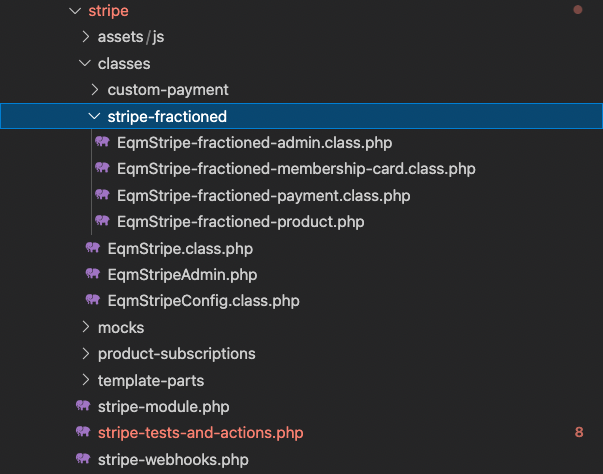
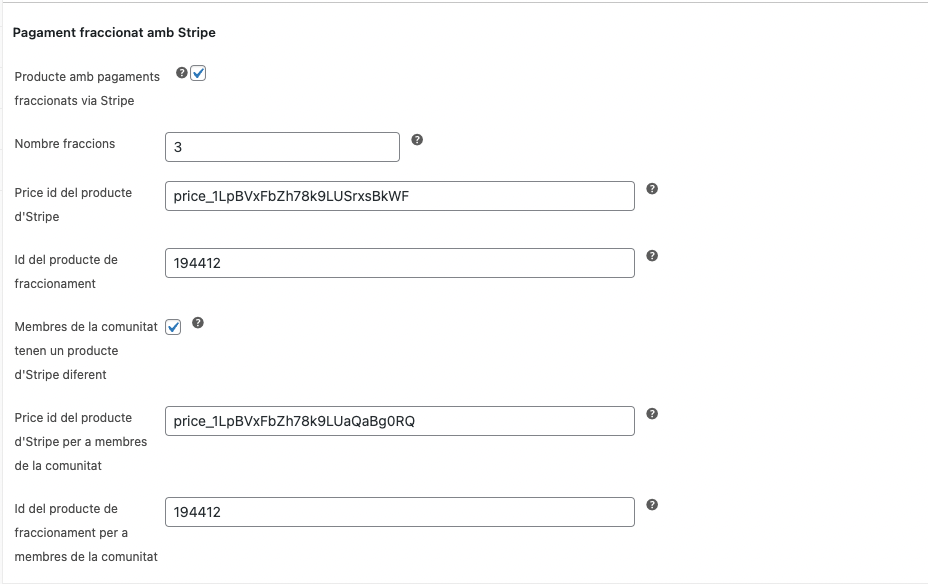
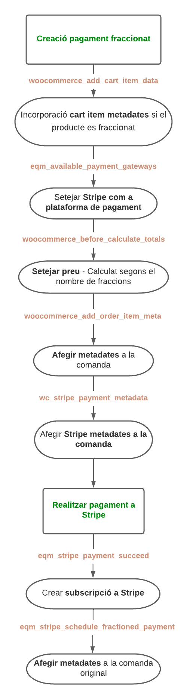
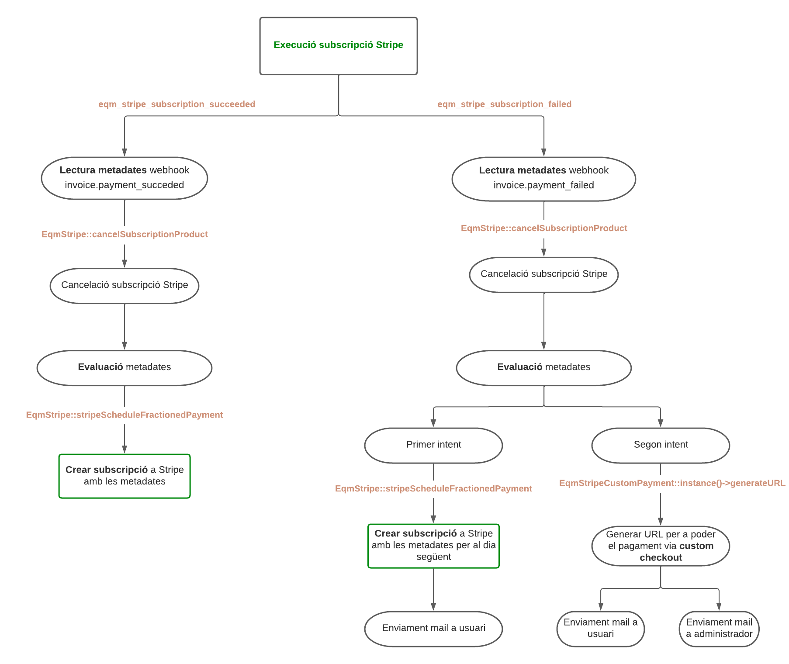

# Fraccionament Stripe

## Definició

Permet realitzar pagament de productes de forma fraccionada utilitzant les subscripcions d'Stripe. 
Des de l'administrador podem indicar el nombre de quotes fraccionades que tindrà el producte
i aquest calendaritzarà un cap cada mes una subscripció del producte a Stripe.

&nbsp; 
>Els pagaments de les quotes posteriors al primer pagament faran la compra d'un altre producte diferent al del curs, 
per tal de no alterar les estadistiques.
&nbsp; 

El sistema està preparat per fraccionar tant els cursos, com els carnets de soci.

Per a utilitzar-lo és necessari tenir instal·lat el pluguin de Woocommerce 
[Stripe by Woocommerce](https://woocommerce.com/products/stripe/). 

Els **pagaments fraccionats** està integrat dins el mòdul de **stripe** de l'aplicació de l'ETS.

&nbsp; 

## Productes subscripció Stripe

Cada subscripció o pagament fraccionat a Stripe ha de tenir creat un producte a Stripe,
un producte pot tenir diferents preus.
Nosaltres sempre treballarem sobre aquests preus, els quals tenen un id associat del tipus

    price_1JsPQ7ACXnwbIbhN2GthIT5Q

&nbsp; 

>Per a crear aquest productes a Stripe s'ha d'accedir a l'apartat **products** i crear el producte,
dins de cada producte podem crear quants preus podrà disposar.

&nbsp; 

## Organització arxius

L'organització dels pagaments fraccionat, integrat dins el mòdul d'Stripe es el següent:
&nbsp; 

* `classes`- El domini de l'aplicació s'ubica dins la carpeta **stripe-fractioned** on hi trobem les principals
classes per al funcionament. 

&nbsp; 

## Definició classes

**EqmStripeFractionedPayment**

*eqm/modules/Woocommerce/stripe/classes/stripe-fractioned/EqmStripe-fractioned-payment.class.php*

**Classe principal de l'aplicació**, encarregada de carregar els controladors de l'administrador i de les funcionalitats
dels tipus de productes ( productes en general, carnets comunitat ). 

També és l'encarregada de desenvolupar les accions comunes d'ambdós tipus de producte. És qui porta el fluxe principal
de l'aplicació. 

***

**EqmStripeFractionedMembershipCard**

*eqm/modules/Woocommerce/stripe/classes/stripe-fractioned/EqmStripe-fractioned-membership-card.class.php*

Classe encarregada de **gestionar els pagaments fraccionats d'un carnet de soci**. Gestiona les comandes fallides i les correcte.  
Seteja la taula dels **periodes de kpis**, l'import total gastat per l'usuari en la Comunitat. També modifica la data de subscripció.

***

**EqmStripeFractionedProduct**

*eqm/modules/Woocommerce/stripe/classes/stripe-fractioned/EqmStripe-fractioned-product.php*

Classe encarregada de gestionar els pagaments fraccionats dels productes que **NO siguin un carnet de la Comunitat**.  
Principalment inserta els metadates al crear la subscripció del producte a Stripe. Aquests serviràn per associar el pagament
de la subscripció amb el producte original. Un cop rebem el webhook d'Stripe **invoice.payment_succeed** o **invoice.payment_failed**
podrem vincular-ho amb la comanda i controlar el nombre de quotes que falten per pagar.

***

**EqmStripeFractionedAdmin**

*eqm/modules/Woocommerce/stripe/classes/stripe-fractioned/EqmStripe-fractioned-admin.class.php*

Creació del formulari a la pàgina del producte de l'administrador per guardar les propietats del pagament fraccionat.

&nbsp; 
Inclou les opcions següents:

* `Producte amb pagaments fraccionats via Stripe` - Flag per activar les opcions del pagament fraccionat.
* `Nombre fraccions` - Nombre de quotes. Es crearà una subscripció mensual del producte a Stripe.
* `Price id del producte Stripe` - El codi del producte que haurem de crear a Stripe per a fer la subscripció.
* `Id producte fraccionat` - El producte de Woocommerce que es comprarà una cop s'efectui el pagament d'una quota correctament. Pot ser el mateix producte.
* `Membres de la Comunitat tenen un producte diferent` - Per tal de crear quotes a un preu diferent per a membres de la Comunitat haurem de marcar aquest checkbox. Per tal d'associar un altre id d'Stripe al producte.
* `Price id del producte d'Stripe per a membres de la Comunitat` - Producte d'Stripe que es crearà la subscripció quan l'usuari sigui membre de la Comunitat.
* `Id producte per a membres de la Comunitat` - Producte de Woocommerce que es comprarà un cop s'efectui el pagament d'una quota correctament quan sigui l'usuari sigui membre de la Comunitat.

***

## Fluxe de funcionament

La generació dels pagaments fraccionats compta amb diverses parts:

* `1. Crear producte fraccionat` - Des de l'administrador al crear un producte, li hem d'activar les opcions del producte fraccionat.
* `2. Crear comanda` - Crear la comanda per tal de generar uns subscripció al producte.
* `3. Recepció de la subscripció` - Evaluar les metadates un cop s'ha executat la subscripció a Stripe.

&nbsp; 

**Crear comanda**

>Important! Perquè un producte sigui fraccionat ha de tenir activat les opcions de fraccionament a l'administrador i el query param 
de stripe-fractione = true

	'?add-to-cart=' . SLOW_AGING_ID . '&stripe-fractioned=true'

*eqm/modules/Woocommerce/workshop/custom/workshop-slow-aging.php*

***

**Recepció de la subscripció**

Fluxe quan s'executa la subscripció d'un producte fraccionat a Stripe. 

&nbsp; 

Aquest fluxe el podem trobar en el arxius:

*eqm/modules/Woocommerce/stripe/classes/stripe-fractioned/EqmStripe-fractioned-payment.class.class.php*
*eqm/modules/Woocommerce/stripe/classes/stripe-fractioned/EqmStripe-fractioned-product.class.php*
*eqm/modules/Woocommerce/stripe/classes/stripe-fractioned/EqmStripe-fractioned-membership-card.class.php*

&nbsp; 

## Metadates

Per tal de crear una comanda amb un producte fraccionat haurem de crear les següents metadates que li enviarem
al crear la subscripció del producte a Stripe.

	$stripe_data 	= [

			'stripe_customer_id' 				 	=> Id de l'usuari a Stripe
			'order_id'                        		=> Order id de la comanda original,
			'product_type'                     		=> 'soci' // tipus de producte,
			'product_id'                  	 		=> Id del producte,
			'eqm_scheduled_subscription_date' 		=> 'none',
			'fractioned_payment'			 	 	=> true  // Li indiquem que es fraccionat,
			'eqm_fractioned_products'			 	=> Id del producte,
		];

		$props = [
				
			'item_meta_id'				=> id del item meta de la comanda original,	
			'product_id' 				=> producte original,
			'num_fractions' 			=> numero tota. de fraccions,
			'price_id' 					=> $Id del producte d'Stripe,
			'wc_product_id' 			=> Proucte actual,
			'intents'					=> Nombre 'd'intents
		];

*eqm/modules/Woocommerce/stripe/classes/stripe-fractioned/EqmStripe-fractioned-product.class.php*
*eqm/modules/Woocommerce/stripe/classes/stripe-fractioned/EqmStripe-fractioned-membership-card.class.php*

&nbsp;

Adicionalment també incorporarem a la comanda les següents metadates.

	public function fractioned_payment_succeeded( $user_id, $product_id, $order_id, $order, $price_props ) {

		$metadata = $price_props['metadata'];
		
		if ( !$metadata->fractioned ) return;

		$this->order_id = $order_id;
		$order_id = $order->get_id();
		update_post_meta( $order_id, 'eqm_stripe_fractioned', true );
		update_post_meta( $order_id, 'eqm_stripe_fractioned_num_fraction', intval( $metadata->current_fraction ) );
		update_post_meta( $order_id, 'eqm_stripe_fractioned_total_fractions', intval( $metadata->num_total_fractions ) );
		update_post_meta( $order_id, 'eqm_stripe_fractioned_original_order', $metadata->order_id );
	
		$this->order_add_success_notes( $order, $price_props );

	}

*eqm/modules/Woocommerce/stripe/classes/stripe-fractioned/EqmStripe-fractioned-payment.class.php*

&nbsp;

