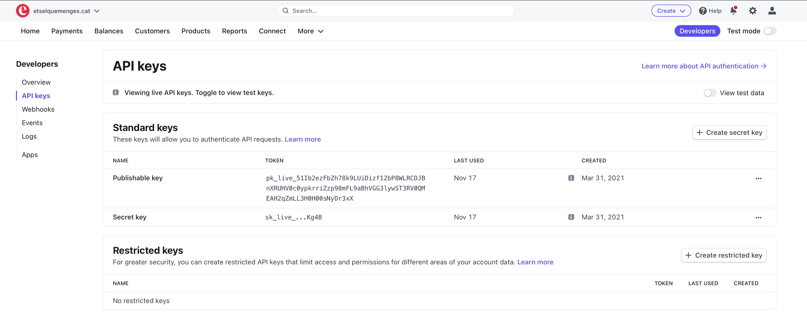
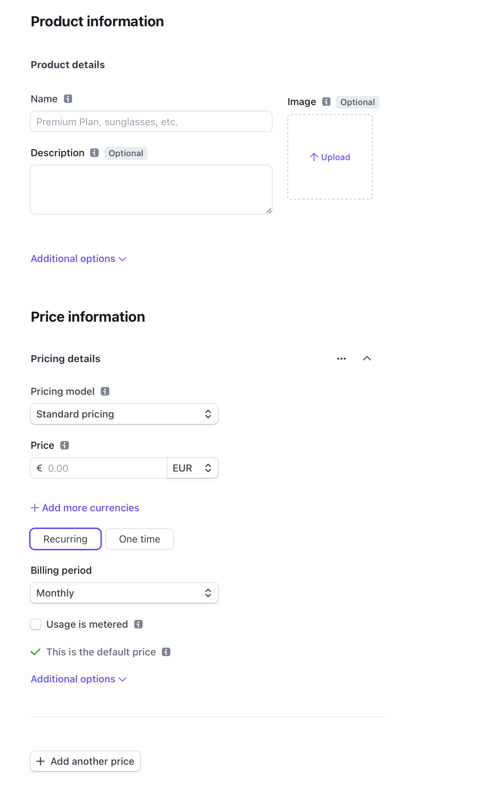
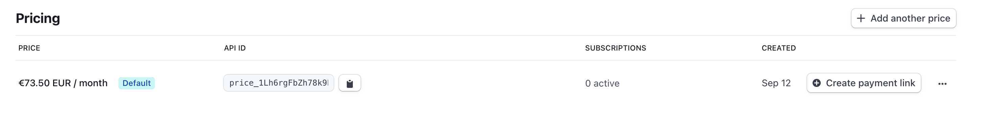
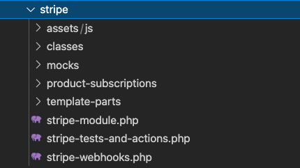
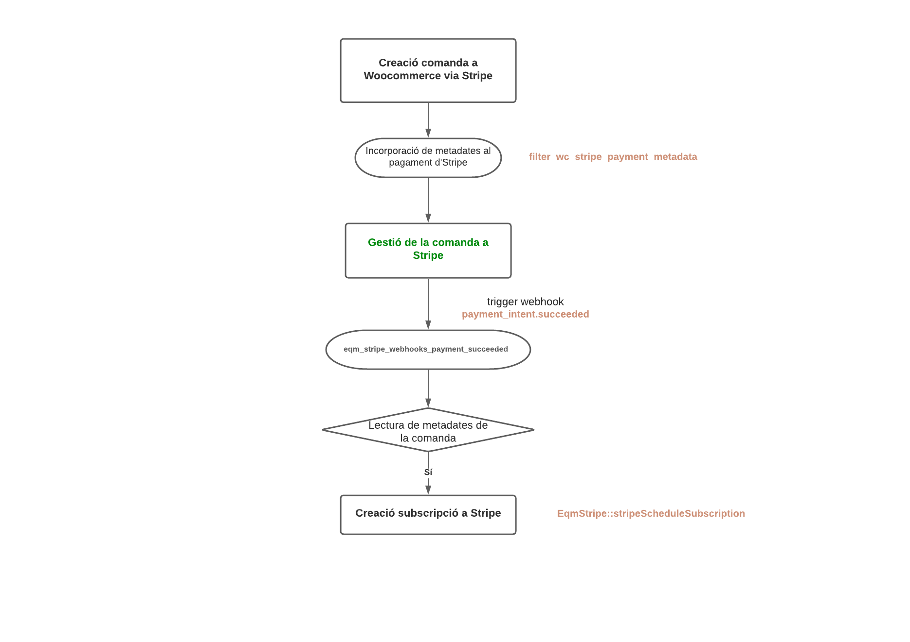
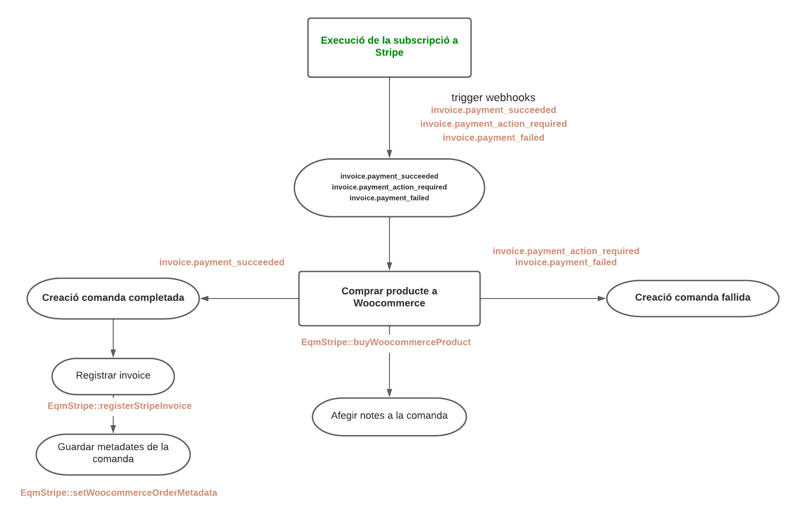

# Stripe

## Definició

**Stripe** és la plataforma de pagament que utilitzem per a realitzar els pagaments
que necessitin una subscripció, fraccionament o quan es vulgui que el pagament sigui
més ràpid i senzill.  

Per a utilitzar-lo és necessari tenir instal·lat el pluguin de Woocommerce 
[Stripe by Woocommerce](https://woocommerce.com/products/stripe/). 

Per part de la plataforma de l'ETS ens comuniquem amb Stripe via API i amb certs
webhooks que ens ofereix la plataforma de desenvolupament d'Stripe.

## Configuració de l'API Stripe

Stripe disposa d'una molt bona documentació de la seva API que es pot consutar
a en aquesta [pàgina](https://stripe.com/docs/api?lang=php).
Important descarregar-se el paquet d'Stripe via **Composer**. 

Hem de configurar Stripe els següents parametres: 

**Api Keys** 
Per a crear les credencials s'ha d'accedir a l'apartat de Developers d'Stripe 
&nbsp;

**EqmStripeConfig** 

Introduirem aquestes claus al nostre mòdul d'Stripe a la classe de configuració:

> eqm\Stripe\EqmStripeConfig

*eqm/modules/Woocommerce/stripe/classes/EqmStripeConfig.class.php*

    private static $stripeKey
    

## Webhooks

Stripe crea webhooks que llença quan succeeixen certs esdeveniments en la plataforma. 
Necessitarem connectar-nos a aquests esdeveniments per tal d'actuar per a cadscun d'ells, serà
la nostra connexió amb Stripe quan en la seva plataforma i hagi actuacions 

**Configurar Webhooks a Stripe Developers** 

Per a crear els webhooks s'ha d'accedir a l'apartat de **Developers d'Stripe**.
Accedir a l'apartat de webhooks. Crear un **hosted endpoint** amb la url: 

    https://etselquemenges.cat/?wc-api=wc_stripe

&nbsp; 
Incorporar-hi com a minim els següents webhooks: 

* `payment_intent.succeeded` - Es llença quan una compra des del web a Stripe ha estat exitosa ( no una subscripció ).
* `invoice.payment_succeeded` - Es llença quan una subscripció es pagada amb éxit.
* `invoice.payment_action_required` - Es llença quan una subscripció ha fallat.
* `invoice.payment_failed` - Es llença quan una subscripció ha fallat.

&nbsp; 
L'escolta i gestió d'aquests webhooks ho farem des del hook

    add_action('woocommerce_api_request','eqm_webhook_request');

*eqm/modules/Woocommerce/stripe/stripe-webhooks.php*

## Productes subscripció Stripe

Cada subscripció o pagament fraccionat a Stripe ha de tenir creat un producte a Stripe,
un producte pot tenir diferents preus.
Nosaltres sempre treballarem sobre aquests preus, els quals tenen un id associat del tipus

    price_1JsPQ7ACXnwbIbhN2GthIT5Q

Com hem comentat anteriorment, a la classe de **configuració d'Stripe** *EqmStripeConfig*
tindrem associat els id's d'Stripe amb els id's de producte de l'aplicació de l'ETS. 

>Per a crear aquest productes a Stripe s'ha d'accedir a l'apartat **products** i crear el producte,
dins de cada producte podem crear quants preus podrà disposar.

## Organització de carpetes, arxius i classes

L'organització del mòdul d'Stripe es el següent:
&nbsp; 

**assets** 

Ubicació dels arxius JS i css. Actualment s'està carregant la funcionalitat 
per crear pagaments customitzats per usuaris des del gestor. 

**classes** 

Hi trobarem el domini de l'aplicació, encarregat de totes les funcionalitats i connexió amb Stripe

* `EqmStripe` - Classe on estatica encarregada de creació de subscripció, comandes a 
woocommerce i gestió dels customers d'Stripe. **Classe principal de l'aplicació**
* `EqmStripeAdmin` - Encarregada de gestionar les subscripcions a la Comunitat dels usuaris dins el perfil
d'aquests al **gestor d'administrador**.
* `EqmStripeConfig` - Dades de configuració: Api Keys i correspondecia d'ids de productes entre aplicacions.

**mocks** 

Simulació dels json de resposta dels webhooks llençats per Stripe 
Utilitzats per crear subscripcións a stripe o crear comandes valides o fallides a woocommerce 

**product-subscriptions** 

Incorporació de les funcionalitats propies de cadascun dels productes en subscripció que tenim:

* `discord-pro` - Creat per executar subscripcions a la plataforma de Discord. **Actualment sense utilitzar**.
* `members` - Encarregat de gestionar els esdeveniments associats a subscripcions de membres de la Comunitat.

**template-parts** 

Templates d'html de l'aplicació tant per la part de publica com de l'administrador. 

**stripe-module** 

Punt d'entrada de l'aplicació on s'inicialitzen els controladors per la part publica i d'administrador.

**stripe-test-and-actions** 

Arxiu preparat per a fer **testeig** de les diferents funcionalitats i procediments que executa l'aplicació. 
D'altra banda també s'utilitza per **executar accions concretes i puntuals**. 
Actualment el podem utilitzar de **repositori** d'aquestes accions per a ser reaprofitades en un futur.

**stripe-webhooks** 

Punt d'entrada de l'API de Woocommerce des d'on escoltarem i gestionarem els webhooks que es llencen
des d'Stripe.

## Selecció d'Stripe com a plataforma de pagament

La plataforma d'Stripe l'utilitzarem en el cas que hi hagi una carnet de la Comunitat
al carro, un productes amb **fraccionament**, quan vinguin d'un **one page checkout** i quan
sigui un **custom checkout** 

En els casos que utilitzem només Stripe, eliminem de l'array les altres pasarel·les de pagament.

> $available_gateways;

**Comunitat**

    add_filter( 'woocommerce_available_payment_gateways', 'eqm_set_payment_method_by_product_category', 10, 1 );

*eqm/modules/Woocommerce/checkout-management/checkout-getaway.php*

**One page Checkout**

    add_filter( 'eqm_available_payment_gateways', 'eqm_set_payment_method_by_one_page_product', 10, 10 );

*eqm/modules/Woocommerce/checkout-management/checkout-one-page.php*

**Fraccionats**

    add_filter( 'eqm_available_payment_gateways', [ $this, 'setGatewayByFractionedProducts' ], 10, 1 );

*eqm/modules/Woocommerce/payment-management/RedsysFractionedPayments.php*

## Creació d'una subscripció

Fluxe des de la comanda a la creació d'una subscripció a Stripe:

Punts importants a tenir en compte:

**Introducció de metadates per a crear subscripció a la Comunitat**

    add_filter( 'wc_stripe_payment_metadata', 'filter_wc_stripe_payment_metadata', 10, 3 );

*eqm/modules/Woocommerce/stripe/stripe-webhooks.php*

Per a crear una **subscripció a la Comunitat** és importat que a la comanda d'Stripe arribin
aquestes metadates que a la recepció del webhook de pagament realitzat amb èxit, analitzarem
i validarem per a poder crear la **subscripció al producte**.

    // Tipus de producte, en el cas de Comunitat es 'Soci'
    $metadata[ __( 'eqm_product', 'woocommerce-gateway-stripe' ) ]

    // Product id - Id del nostre producte 								
	$metadata[ __( 'eqm_product_id', 'woocommerce-gateway-stripe' ) ]

    // Data final de subscripció. La mateixaque introduïm a les metas de l'usuari.					
	$metadata[ __( 'eqm_scheduled_subscription_date', 'woocommerce-gateway-stripe' ) ]

*eqm/modules/Woocommerce/stripe/stripe-webhooks.php*

&nbsp; 

**Guardar targeta crèdit de l'usuari**

Important forçar guardar la targeta de l'usuari a Stripe.
Ho fem amb el següent hook

    /*
    * Force to save credit card when buy a product
    *
    */
    add_filter( 'wc_stripe_force_save_source', '__return_true' );

*eqm/modules/Woocommerce/stripe/stripe-webhooks.php*

&nbsp; 

**Creació de subscripció**

Amb el json que rebem del webhook *payment_intent.succeeded* procedim a la validació
de les metadates.

Un cop validat, mirem si l'usuari te una subscripció, en cas positiu la cancel·lem
per introduir la nova.

Creem una subscripció cridant el metode:

    EqmStripe::stripeScheduleSubscription( $stripe_data['stripe_customer_id'], $stripe_data['eqm_scheduled_subscription_date'], $product_type, $product_id );

*eqm/modules/Woocommerce/stripe/stripe-webhooks.php*

Aquest fa una petició al servei de l'API d'Stripe

> subscriptionSchedules

[API subscriptionSchedules](https://stripe.com/docs/api/subscription_schedules/object) 

## Execució d'una subscripció a Stripe 

Fluxe des de l'execució i pagament d'una subscripció a la creació de la comanda a Woocommerce 

Punts importants a tenir en compte:

**Escolta webhook subscripció executada**

    invoice.payment_succeeded
    invoice.payment_action_required
    invoice.payment_failed

*eqm/modules/Woocommerce/stripe/stripe-webhooks.php*

**Compra producte a woocommerce**

    EqmStripe::buyWoocommerceProduct( $event_json, true );

*eqm/modules/Woocommerce/stripe/stripe-webhooks.php*

Executem aquest mètode per comprar un producte a woocommerce amb les dades que
rebem del webhook llençat per Stripe.

Un cop fetes les validacions de les dades que ens aporta el json, amb el
producte, import i metadates creem la comanda amb el metode

    EqmStripe::woocommerceOrderProductUser( $user_id, $product_id, $price, $payment_id, $stripe_id, $order_failed );

*eqm/modules/Woocommerce/stripe/classes/EqmStripe.class.php*

Crearem una comanda completada o fallida segons el webhook que rebem. 

D'altra banda registrem la invoice per prevenir que es torni a executar la creació de la comanda.

    EqmStripe::registerStripeInvoice( $user_id, $order_id, $stripe_id );

*eqm/modules/Woocommerce/stripe/classes/EqmStripe.class.php*

**Guardar metadates**

Guardem les metadates com si la comanda hagués estat creada per Stripe

    EqmStripe::setWoocommerceOrderMetadata( $order, $status, $price_props );

*eqm/modules/Woocommerce/stripe/classes/EqmStripe.class.php*

## Modificació de la subscripció

L'usuari pot modificar la seva subscripció ( activar-la o reactivar-la ) des de
l'area de socis.
Des de l'administrador també ho podem fer accedint al perfil de l'usuari.

Es possible cancelar, reactivar o modificar una subscripció ( cancelar l'actual per substituir-la per una altra )

    EqmStripe::cancelSubscription( MEMBERSHIP_LABEL );
    EqmStripe::reactivateSubscription( MEMBERSHIP_LABEL, $start_date, $product_id );
    EqmStripe::updateSubscription( MEMBERSHIP_LABEL, $start_date, EqmMemberCards::getRenovacioId() );

*eqm/modules/Woocommerce/stripe/classes/EqmStripe.class.php*

Documentació API:

[API cancel Subscriptions](https://stripe.com/docs/api/subscriptions/cancel) 
[API cancel Schedule Subscriptions](https://stripe.com/docs/api/subscription_schedules/cancel)