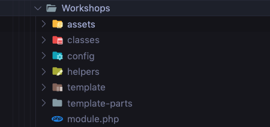

# Workshops

## Definició

El mòdul de workshops és l'encarregat de construir els **cursos online**. 
Per agilitzar la navegació del curs, aquest es construeix en el **backend mitjançant PHP**. Un cop recopilat, ordenat
i muntat el contingut del curs aquest es serveix a **Javascript** per a que el construeixi en el **Frontend**. 
La part visual del curs, però es monta en PHP per tal de mantenir una coherencia en la manera de fer dels
plugin de l'ETS i per facilitar-n'hi la creació. Javascript serà unicament l'encarregat de pintar-ho.

&nbsp; 

## Organització de carpetes, arxius i classes

L'organització del mòdul de **Workshops** es el següent:
&nbsp; 

**assets** 

Ubicació dels arxius JS i imatges. Els arxius JS són els encarregates de construïr el FrontEnd

* `workshop-dom`- Classe encarregada de gestionar els esdeveniments que es donin en el DOM.
* `workshop-forum`- Classe encarregada de construïr i gestionar el Fòrum. Per no excedir en la càrrega inicial. El Fòrum es càrrega un cop entre
en cada Topic.
* `workshop-mgr`- Classe principal, encarregada d'executar al carrega inicial del curs, guardar les propietats i contingut del curs. Construïr el curs, i gestionar tots els esdeveniments que faci l'usuari amb l'aplicació.
* `workshop-paperform`- Classe encarregada de gestionar les lliçons del tipus examen, mostrar l'examen i analitzar els resultats obtinguts per l'alumne i guardar el resultat.
* `workshop-support`- Classe encarregada de gestionar el formulari de suport.

***

**classes** 

Backend de l'aplicació. 
Ordenarem les classes per ordre d'execució:

* `ControllerWorkshops`- 
* `Workshop`- 
* `WorkshopLoader`- 
* `WorkshopLoaderTemplates`- 
* `WorkshopAjax`- 
* `Module`- 
* `Lesson`- 
* `Materials`- 
* `Forum`- 
* `WorkshopLandings`- 
* `WorkshopPaperForm`- 
* `Comments`- 

***

**config** 

Ubicació dels arxius JS i css. Actualment s'està carregant la funcionalitat 
per crear pagaments customitzats per usuaris des del gestor. 

***

**helpers** 

Ubicació dels arxius JS i css. Actualment s'està carregant la funcionalitat 
per crear pagaments customitzats per usuaris des del gestor. 

***

**template** 

Ubicació dels arxius JS i css. Actualment s'està carregant la funcionalitat 
per crear pagaments customitzats per usuaris des del gestor. 

***

**template-parts** 

Ubicació dels arxius JS i css. Actualment s'està carregant la funcionalitat 
per crear pagaments customitzats per usuaris des del gestor. 

***

&nbsp; 

## Fluxe de funcionament

&nbsp; 

## Administrador - Opcions curs

&nbsp; 

## Tipus de cursos

* `Demo`- 
* `Previst`- 
* `Audio-vídeo`- 
* `Recepta`- 
* `Text`- 
* `Descarrega`- 
* `Examen`- 

&nbsp; 

## Backend - Creació curs

&nbsp; 

**Carrega i accés**

dfadfadf df adfsd

***

**Mòduls**

dfadfadf df adfsd

***

**Lliçons**

dfadfadf df adfsd

***

**Tipus lliçons**

* `Vídeo`- 
* `Audio`- 
* `Audio-vídeo`- 
* `Recepta`- 
* `Text`- 
* `Descarrega`- 
* `Examen`- 

dfadfadf df adfsd

***

**Materials**

dfadfadf df adfsd

***

**Fórum**

dfadfadf df adfsd

***

**Suport**

dfadfadf df adfsd

***

## Control d'accés

**Accés al curs**

dfadfadf df adfsd

***

**Accés als mòduls**

dfadfadf df adfsd

***

**Accés a les lliçons**

dfadfadf df adfsd

***

## FrontEnd - Construcció curs

&nbsp; 

## Workshop Landings i control d'accés

&nbsp; 

## Workshop utils

&nbsp; 

Lorem markdownum adstricta **rege bella Agenorides** notat Veneris mordetur
collegit rarissima atque. Ait illis ne vade haec cursus silvas Cyllene sed artem
nitidique mare dixi morari, undique etiamnunc. Inmurmurat fraudesque iaces, mane
quam at Cipe. Ramis flammifera senes: est solverat curia nostraque movet,
[tritis](http://www.decus.io/), et.

    mips_network_samba(passive, engineServerSchema);
    vector = upnp_wrap(100 + wikiAdapterLaser, pitch_definition_uml(3, 753354,
            consoleNicMatrix) + exploit(2), integrated_safe(
            responsive_vrml_suffix * 2));
    var vle_spyware_pum = web(transistor);

Stamina hirsuta, et pedum **exitio** aras dicta nocte ab bovem inducere que.
Dextraque quater tangunt de dique quaeri: ad nostrum causam praecipitatur ultima
at oscula Cinyra mors natis et praesagia omnipotens?

Ursos fontem timor commenta eras vires orsa, ero odere. Guttura annis dedissent
sepulcro.

## Et aut habitavit deum adeunt est fatale

Est veri hebeti vacca, fui nullo, tritis pelagoque habuit, carbasa. Ingreditur
sine iamque nutrici suasit, proditione ignotas tacitorum qui putes, abiturus me
calores. Tandem vetitis pronuba, pavet caloris, fractaque tellus barbae!
*Dubitabat naturale* omne urna ubi aris loco doluit et autumnus haec hinc
volucrum umor. Undis additus absumptis vittam, *nequeo ossa* votisque fecit
genitor perdidit omnes, rigidas.

> Fregit fraudesque vetusto laetatur. Dea vestrum erit esse fugat addidit illum,
> diuque ubi corpus Iovem. Potitur non neque illi, Atlantiades nimium et Circaea
> caecis os mira. Pares sub. Dicenti vel insomni tibi, iussis se stolidaeque
> pectore tulit haesit sic Thestorides, fine, sonarent!

Tu modo delet in vivos est amore cum, Solis vomunt. Illi exsanguemque classe
Nonacrina verba, eodem, poplite, haec ille inmemor.

1. Tumulo coluere vocalis edidit
2. Sum anno modo triones
3. Sedit nostra

Nunc tellure Corinthiaci collo movit vidit possis artus, petens hoste nec.
Sanguine diducit tibi, quid inque velocior, erat manus, tuam. Talibus herbas,
habet ornat radice comitantiaque sacra [manusque
referemus](http://haec.org/loquentis-arasque.html) resimas spes, huc nostrum
veniam, in.

## Et aut habitavit deum adeunt est fatale 2

Est veri hebeti vacca, fui nullo, tritis pelagoque habuit, carbasa. Ingreditur
sine iamque nutrici suasit, proditione ignotas tacitorum qui putes, abiturus me
calores. Tandem vetitis pronuba, pavet caloris, fractaque tellus barbae!
*Dubitabat naturale* omne urna ubi aris loco doluit et autumnus haec hinc
volucrum umor. Undis additus absumptis vittam, *nequeo ossa* votisque fecit
genitor perdidit omnes, rigidas.

> Fregit fraudesque vetusto laetatur. Dea vestrum erit esse fugat addidit illum,
> diuque ubi corpus Iovem. Potitur non neque illi, Atlantiades nimium et Circaea
> caecis os mira. Pares sub. Dicenti vel insomni tibi, iussis se stolidaeque
> pectore tulit haesit sic Thestorides, fine, sonarent!

Tu modo delet in vivos est amore cum, Solis vomunt. Illi exsanguemque classe
Nonacrina verba, eodem, poplite, haec ille inmemor.

1. Tumulo coluere vocalis edidit
2. Sum anno modo triones
3. Sedit nostra

Nunc tellure Corinthiaci collo movit vidit possis artus, petens hoste nec.
Sanguine diducit tibi, quid inque velocior, erat manus, tuam. Talibus herbas,
habet ornat radice comitantiaque sacra [manusque
referemus](http://haec.org/loquentis-arasque.html) resimas spes, huc nostrum
veniam, in.
